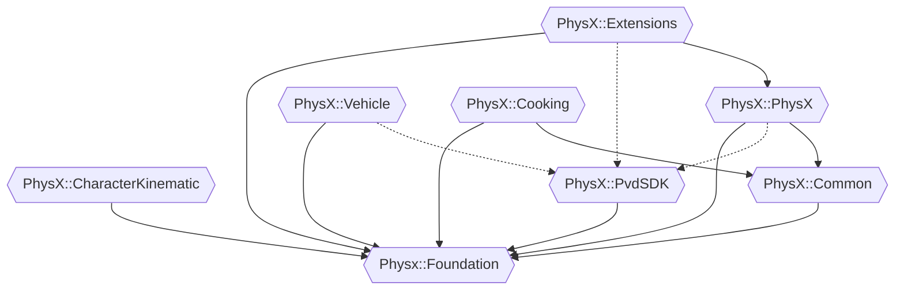

# PhysX_CMaketargets

This is a fork of the NVIDIA PhysX SDK with added CMake targets.

**Only tested on Windows and WSL**

## Features

After cloning, PhysX can be included with either
```cmake
find_package(PhysX REQUIRED PATHS <path_to_physx_root>)
```
or
```cmake
include(<path_to_physx_root>/PhysXConfig.cmake)
```

This will specify all PhysX targets contained in a "PhysX" namespace. To link them, use:
```cmake
target_link_libraries(<target> PhysX::PhysX PhysX::Common PhysX::Foundation ...)
```

PhysX will be configured at your projects configure time and built at your projects build time. PhysX will be built on demand. When the necessary binaries already exist, PhysX will not be rebuilt.

## Targets
- PhysX::PhysX
- PhysX::Common
- PhysX::Foundation
- PhysX::Extensions
- PhysX::Task
- PhysX::Vehicle
- PhysX::Cooking
- PhysX::CharacterKinematic
- PhysX::PvdSDK

The link order should be according to this dependency graph, meaning `PhysX::Extensions` is always linked first and `PhysX::Foundation` is always linked last:



A minimal selection might be:
```cmake
target_link_libraries(<target> PhysX::Extensions PhysX::PhysX PhysX::Common PhysX::Foundation)
```

## Options

| Option | Explanation |
|---|---|
| PHYSX_PRESET | Either one of the presets defined by PhysX at <PhysX_root>/physx/buildtools/presets/public, specified with its filename without extension or a user defined preset, specified with its path. Default is "vc17win64"
| PHYSX_CONFIG | The compile configuration to use. debug, checked, profile and release can be used Default is "checked". **Must be specified at configure time**
| PHYSX_BUILD_PARALLEL_LEVEL | The parallel level that will be passed to the PhysX build step. Valid format: [-j or --parallel] <Number>
| PYTHON_COMMAND | Where to find python, default is "python"

## Dependencies

- Python 2.7.6 or higher
- CMake
- MSVC (VS 2022 is supported)

# NVIDIA PhysX SDK 4.1

Copyright (c) 2021 NVIDIA Corporation. All rights reserved.

Redistribution and use in source and binary forms, with or without
modification, are permitted provided that the following conditions
are met:
 * Redistributions of source code must retain the above copyright
   notice, this list of conditions and the following disclaimer.
 * Redistributions in binary form must reproduce the above copyright
   notice, this list of conditions and the following disclaimer in the
   documentation and/or other materials provided with the distribution.
 * Neither the name of NVIDIA CORPORATION nor the names of its
   contributors may be used to endorse or promote products derived
   from this software without specific prior written permission.

THIS SOFTWARE IS PROVIDED BY THE COPYRIGHT HOLDERS ``AS IS'' AND ANY
EXPRESS OR IMPLIED WARRANTIES, INCLUDING, BUT NOT LIMITED TO, THE
IMPLIED WARRANTIES OF MERCHANTABILITY AND FITNESS FOR A PARTICULAR
PURPOSE ARE DISCLAIMED.  IN NO EVENT SHALL THE COPYRIGHT OWNER OR
CONTRIBUTORS BE LIABLE FOR ANY DIRECT, INDIRECT, INCIDENTAL, SPECIAL,
EXEMPLARY, OR CONSEQUENTIAL DAMAGES (INCLUDING, BUT NOT LIMITED TO,
PROCUREMENT OF SUBSTITUTE GOODS OR SERVICES; LOSS OF USE, DATA, OR
PROFITS; OR BUSINESS INTERRUPTION) HOWEVER CAUSED AND ON ANY THEORY
OF LIABILITY, WHETHER IN CONTRACT, STRICT LIABILITY, OR TORT
(INCLUDING NEGLIGENCE OR OTHERWISE) ARISING IN ANY WAY OUT OF THE USE
OF THIS SOFTWARE, EVEN IF ADVISED OF THE POSSIBILITY OF SUCH DAMAGE.

## Introduction

Welcome to the NVIDIA PhysX SDK source code repository. This depot includes the PhysX SDK and the Kapla Demo application.

The NVIDIA PhysX SDK is a scalable multi-platform physics solution supporting a wide range of devices, from smartphones to high-end multicore CPUs and GPUs. PhysX is already integrated into some of the most popular game engines, including Unreal Engine, and Unity3D. [PhysX SDK on developer.nvidia.com](https://developer.nvidia.com/physx-sdk).

## Documentation

Please see [Release Notes](http://gameworksdocs.nvidia.com/PhysX/4.1/release_notes.html) for updates pertaining to the latest version.

The full set of documentation can also be found in the repository under physx/documentation or online at http://gameworksdocs.nvidia.com/simulation.html 

Platform specific information can be found here:
* [Microsoft Windows](http://gameworksdocs.nvidia.com/PhysX/4.1/documentation/platformreadme/windows/readme_windows.html)
* [Linux](http://gameworksdocs.nvidia.com/PhysX/4.1/documentation/platformreadme/linux/readme_linux.html)
* [Google Android ARM](http://gameworksdocs.nvidia.com/PhysX/4.1/documentation/platformreadme/android/readme_android.html)
* [Apple macOS](http://gameworksdocs.nvidia.com/PhysX/4.1/documentation/platformreadme/mac/readme_mac.html)
* [Apple iOS](http://gameworksdocs.nvidia.com/PhysX/4.1/documentation/platformreadme/ios/readme_ios.html)
 

## Quick Start Instructions

Requirements:
* Python 2.7.6 or later
* CMake 3.12 or later

To begin, clone this repository onto your local drive.  Then change directory to physx/, run ./generate_projects.[bat|sh] and follow on-screen prompts.  This will let you select a platform specific solution to build.  You can then open the generated solution file with your IDE and kick off one or more configuration builds.

To build and run the Kapla Demo see [kaplademo/README.md](kaplademo/README.md).

## Acknowledgements

This depot contains external third party open source software copyright their respective owners.  See [kaplademo/README.md](kaplademo/README.md) and [externals/README.md](externals/README.md) for details.
